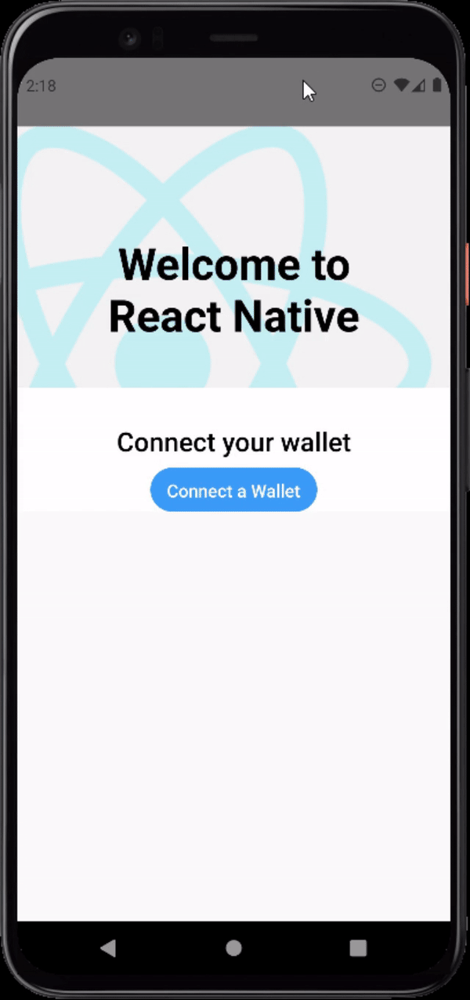

# WalletConnect Example with React-Native-CLI

This is a simple example how to get `WalletConnect` up and running with `React-Native-CLI` for React Native.

## `WalletConnect`'s dependency on Node's `crypto` package

`WalletConnect` uses node's built-in crypto package which is not available on iOS or Android.
In order to work around this we can use `metro.config.js` to create aliases for different packages, this idea is from [here](https://learn.figment.io/tutorials/how-to-successfully-connect-to-a-celo-wallet-with-a-react-native-dapp).
This will allow us to use `WalletConnect` directly from the `expo` client without having to eject the application.

See [here](https://github.com/clxyder/walletconnect-expo-example) on how to run this with `Expo`.

## Getting Started

Please go ahead and install the packages via `yarn install`, then, run `yarn start`.

### Android

From `Android Studio` open the `android` directory, wait for the build to complete.
Once complete, go ahead and press the green play button to have an android emulator launch (See [here](https://developer.android.com/studio/run/emulator) for emulator setup).

Once the build is complete and opened in the app, connect your wallet by pressing the `Connect a wallet` button.

### iOS

Not tested, as I don't have a mac to test this with XCode.

## ⚠️⚠️⚠️ Needs more work ⚠️⚠️⚠️

As one can see from the demo gif, the connect functionality is not complete. This is because deep linking has not been configured correctly. If you have the time, please see the following links and open a PR to try and fix this.

* [Create Deep Links to App Content](https://developer.android.com/training/app-links/deep-linking)
* [Expo Linking](https://docs.expo.dev/guides/linking/?redirected#linking-to-your-app)

## ✅✅✅ Work Around ✅✅✅

A work around for this issue can be found [here](https://github.com/cawfree/create-react-native-dapp/issues/30#issuecomment-1095025847).

## Demo GIF

